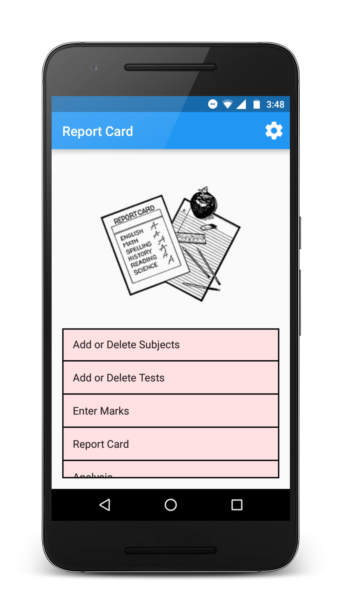
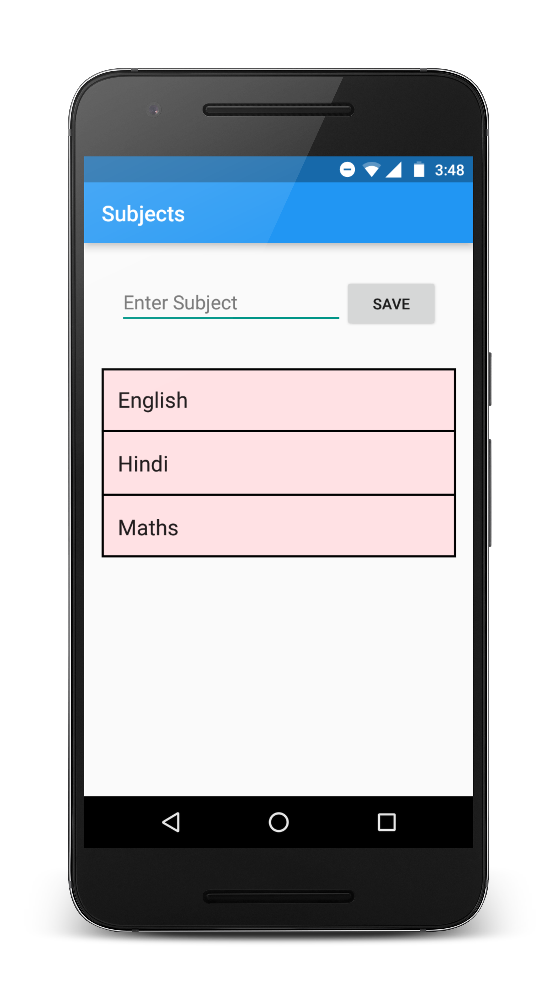
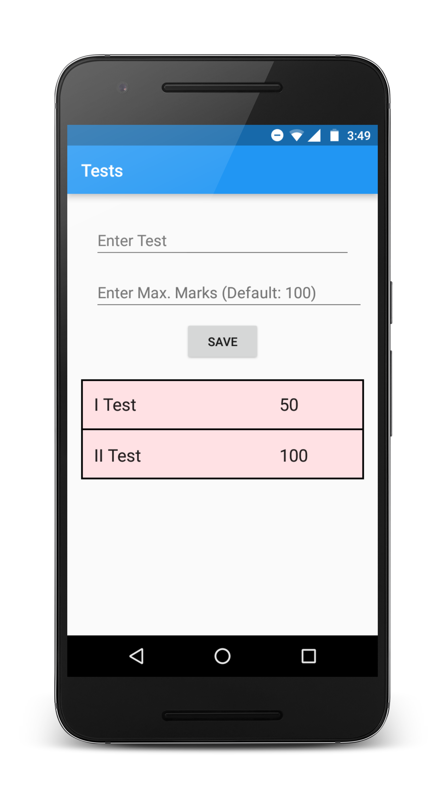
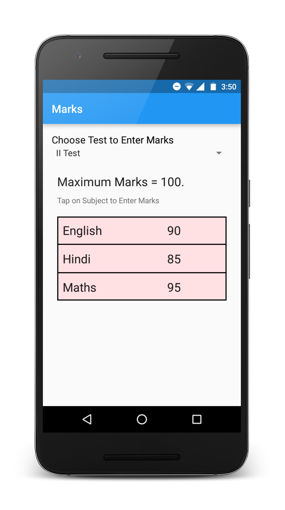
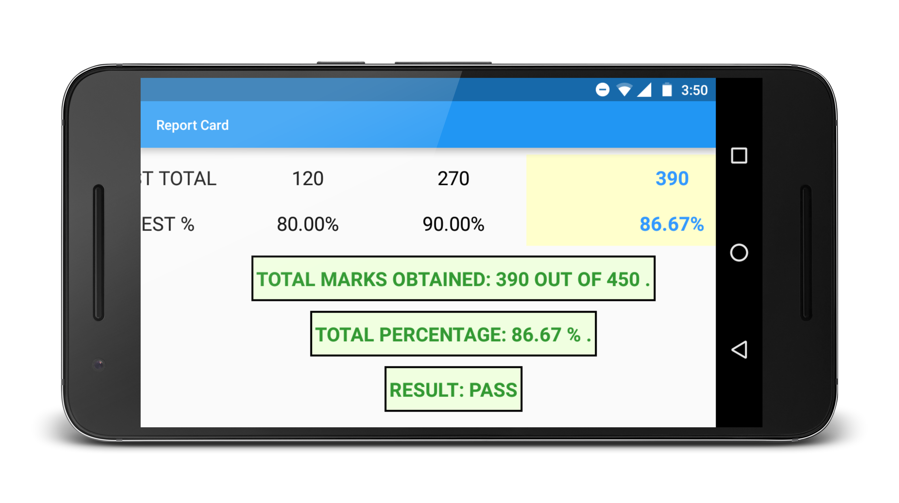
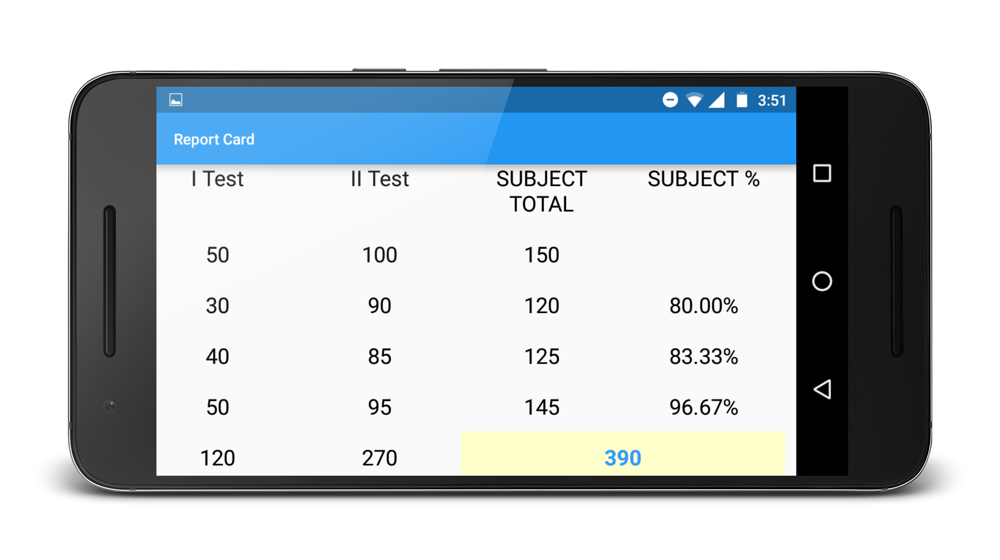
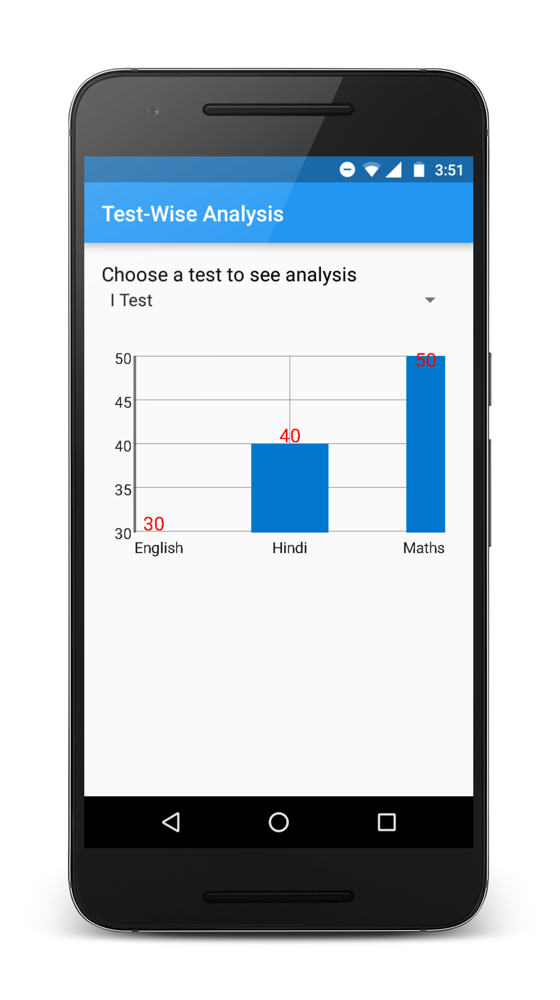
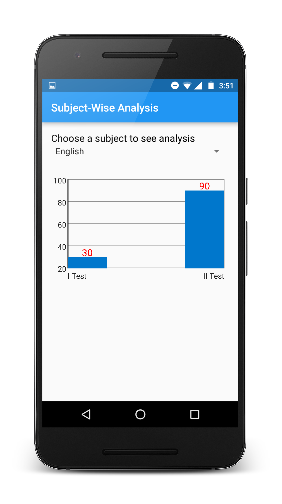

# ReportCard
A simple android app which takes the marks and calculates the total and percentage and generates a report card. Also lets you analyse results using graphs.

## Screenshots

## Graphical Analysis

